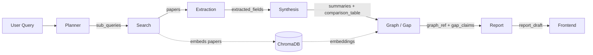
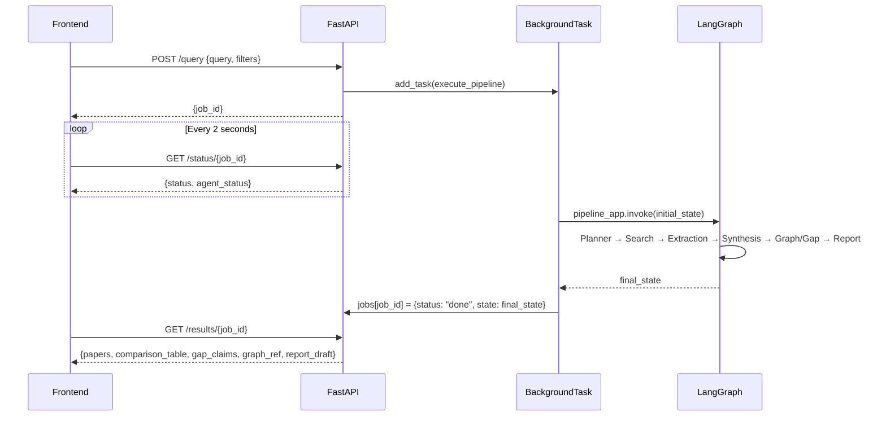

# 🧠 ResearchMind

> **Agentic AI Literature Review & Research Gap Discovery**

ResearchMind is an agentic AI system that automates systematic academic literature reviews. It builds a **citation and topic-similarity network** from live arXiv/Semantic Scholar data, identifies **research gaps** (areas with below-median citation density), and presents a fully inspectable citation subgraph behind every finding — ensuring transparency and auditability at every step.

---

## ✨ Key Features

| Feature | Description |
|---|---|
| 🤖 **6-Agent LangGraph Pipeline** | Planner → Search → Extraction → Synthesis → Graph/Gap → Report |
| 🔍 **Multi-source Search** | Queries arXiv and Semantic Scholar in parallel |
| 🕸️ **Citation Graph Analysis** | NetworkX MultiDiGraph with gap detection via citation density |
| 📊 **Interactive Dashboard** | Vite + React 19 UI with glassmorphic dark-mode styling |
| 📄 **Export Reports** | One-click PDF (ReportLab) and DOCX (python-docx) export |
| 💬 **QA Research Assistant** | Chat-based Q&A over collected papers (similar to Elicit) |
| 🛡️ **Offline Resilience** | Committed fallback dataset + local file-based cache |
| 🧪 **Mock Mode** | Runs fully without API keys using simulated Gemini responses |
| 🔐 **JWT User Authentication** | Secure Register and Login modal with JWT tokens & 7-day session persistence |
| 📜 **GPT-Style Research History** | ChatGPT-style dark sidebar; auto-saves research sessions to SQLite DB for logged-in users |
| 🔁 **Session Persistence** | Browser localStorage saves active progress across page reloads |

---

## 🏗️ Architecture

### Agent Pipeline (LangGraph)

```
User Query
    │
    ▼
┌─────────┐    ┌────────┐    ┌────────────┐    ┌───────────┐    ┌───────────┐    ┌────────┐
│ Planner │───▶│ Search │───▶│ Extraction │───▶│ Synthesis │───▶│ Graph/Gap │───▶│ Report │
└─────────┘    └────────┘    └────────────┘    └───────────┘    └───────────┘    └────────┘
 Sub-queries   arXiv +        Field records     Summaries +       NetworkX +       PDF/DOCX
 & filters     Semantic       & metadata        Comparison        Gap claims       Draft
               Scholar                          table
```

### Tech Stack

| Layer | Technology |
|---|---|
| **Orchestration** | LangGraph (StateGraph) |
| **LLM** | Google Gemini (`gemini-3.6-flash`) |
| **Vector Store** | ChromaDB (with hash-based fallback embeddings) |
| **Graph** | NetworkX (MultiDiGraph) |
| **Backend API** | FastAPI + Uvicorn |
| **Database & Auth** | SQLite (`researchmind.db`) + JWT (`python-jose`, `bcrypt`) |
| **Frontend** | Vite 8 + React 19 (glassmorphic dark-mode UI) |
| **PDF Export** | ReportLab |
| **DOCX Export** | python-docx |
| **PDF Parsing** | PyMuPDF |

---

### Data Flow Diagram



### PipelineState — Central Data Contract

All 6 agents share a single [`PipelineState`](backend/orchestration/pipeline.py) `TypedDict`. Each agent receives the full state, mutates its designated fields, and returns the updated state to LangGraph.

| Field | Type | Written By | Read By | Description |
|---|---|---|---|---|
| `query` | `str` | User | Planner, Report | Original free-text research topic |
| `filters` | `Dict[str, Any]` | User | Planner, Search | Year range, venue type, keywords |
| `sub_queries` | `List[str]` | Planner | Search | 2–4 decomposed facet sub-queries |
| `papers` | `List[PaperMeta]` | Search | Extraction, Synthesis, Graph/Gap | Deduplicated paper metadata objects |
| `extracted_fields` | `List[FieldRecord]` | Extraction | Synthesis | Method / dataset / metric / limitation per paper |
| `summaries` | `List[Summary]` | Synthesis | Report | Per-paper summaries with `[Source: X]` attributions |
| `comparison_table` | `List[Dict]` | Synthesis | Report, Frontend | Flattened paper comparison matrix |
| `graph_ref` | `Any` (JSON) | Graph/Gap | Frontend | NetworkX MultiDiGraph serialised as node-link JSON |
| `gap_claims` | `List[GapClaim]` | Graph/Gap | Report, Frontend | Research gaps with induced subgraph snapshots |
| `report_draft` | `Dict[str, Any]` | Report | Frontend, Export | Keys: `text` (Markdown), `pdf_path`, `docx_path`, `synthesis_text`, `introduction_text` |
| `agent_status` | `Dict[str, Literal]` | All agents | API `/status`, Frontend | Per-agent: `pending` → `running` → `done` / `error` |

---

## 📁 Repository Structure

```
Research-Mind/
├── backend/
│   ├── __init__.py
│   ├── api/                        # FastAPI server & routes
│   │   ├── __init__.py
│   │   ├── deps.py                 # JWT auth dependency helpers
│   │   ├── main.py                 # FastAPI app, CORS, /health, /status endpoints
│   │   ├── jobs.py                 # In-memory jobs dictionary (shared state)
│   │   └── routes/
│   │       ├── __init__.py
│   │       ├── auth.py             # POST /auth/register, /auth/login, GET /auth/me
│   │       ├── history.py          # GET /history, GET /history/{id}, DELETE /history/{id}
│   │       ├── query.py            # POST /query, GET /results, POST /qa endpoints
│   │       └── export.py           # GET /export/{job_id} — PDF/DOCX download
│   ├── agents/                     # 6-agent pipeline stages
│   │   ├── __init__.py
│   │   ├── planner.py              # Sub-query decomposition via LLM
│   │   ├── search.py               # arXiv + Semantic Scholar parallel retrieval
│   │   ├── extraction.py           # Field extraction, PDF parsing & deduplication
│   │   ├── synthesis.py            # Summarization & comparison table generation
│   │   ├── graph_gap.py            # Citation graph construction + gap detection
│   │   └── report.py               # PDF/DOCX report generation
│   ├── orchestration/
│   │   └── pipeline.py             # LangGraph StateGraph wiring & PipelineState
│   ├── clients/                    # External API clients
│   │   ├── __init__.py
│   │   ├── arxiv_client.py         # arXiv API search & XML parsing
│   │   ├── claude_client.py        # Gemini LLM client (named for backward compat)
│   │   └── s2_client.py            # Semantic Scholar API client
│   ├── data/                       # Data layer — models, stores & caching
│   │   ├── __init__.py
│   │   ├── models.py               # Pydantic models (PaperMeta, FieldRecord, etc.)
│   │   ├── cache.py                # File-based JSON cache + exponential backoff
│   │   ├── vector_store.py         # ChromaDB vector store wrapper
│   │   └── graph_store.py          # NetworkX graph builder (CITES, SIMILAR_TOPIC)
│   ├── db/                         # Database module & runtime data directory
│   │   ├── __init__.py             # Package init
│   │   ├── database.py             # SQLite database init & query functions
│   │   ├── cache/                  # Cached API responses
│   │   ├── chroma/                 # ChromaDB persistent storage
│   │   └── exports/                # Generated PDF/DOCX report files
│   ├── .env.example                # Environment variable template
│   └── requirements.txt            # Python dependencies
├── frontend/
│   ├── index.html                  # HTML entry point
│   ├── package.json                # Node dependencies & scripts
│   ├── vite.config.js              # Vite build configuration
│   ├── .oxlintrc.json              # Oxlint linter configuration
│   ├── public/
│   │   ├── favicon.svg             # Browser tab icon
│   │   └── icons.svg               # SVG icon sprite sheet
│   └── src/
│       ├── main.jsx                # React DOM entry point
│       ├── App.jsx                 # Main dashboard, tab routing & API calls
│       ├── App.css                 # App-level overrides
│       ├── index.css               # Design system & glassmorphic styles
│       ├── context/
│       │   └── AuthContext.jsx     # JWT authentication state & functions
│       └── components/
│           ├── AuthModal.jsx       # Login & Registration modal dialog
│           ├── HistorySidebar.jsx  # ChatGPT-style research session history sidebar
│           ├── QueryForm.jsx       # Research query input & filters
│           ├── ProgressTracker.jsx # Live agent status tracker
│           ├── OverviewPanel.jsx   # Results overview & gap cards
│           ├── ComparisonTable.jsx # Sortable/searchable paper matrix
│           ├── GraphViewer.jsx     # Interactive Cytoscape citation graph
│           ├── SourcesSidebar.jsx  # Source paper detail sidebar
│           ├── ReportExport.jsx    # PDF/DOCX export interface
│           └── QAAssistant.jsx     # Chat-based Q&A over research papers
├── tests/
│   ├── unit/                       # Unit tests for each agent
│   │   ├── test_planner.py
│   │   ├── test_search.py
│   │   ├── test_extraction.py
│   │   ├── test_synthesis.py
│   │   ├── test_graph_gap.py
│   │   └── test_report.py
│   └── integration/
│       └── test_pipeline.py        # Full LangGraph pipeline integration test
├── fallback_dataset/               # Committed offline data
│   ├── cache/                      # Pre-fetched search result cache files
│   ├── results_attention_mechanisms.json  # Pre-computed pipeline output
│   └── generate_fallback.py        # Script to regenerate fallback data
├── docs/                           # Project documentation
│   ├── PRD_ResearchMind.docx       # Product Requirements Document
│   ├── SRS_ResearchMind.docx       # Software Requirements Specification
│   ├── TEST_PLAN_ResearchMind.docx # Test Plan
│   ├── BUILD_GUIDE_ResearchMind.docx   # Build & Deployment Guide
│   └── ANTIGRAVITY_BUILD_PROMPT_ResearchMind.md  # Original build prompt
└── .gitignore
```

---

## ⚙️ Prerequisites

- **Python** 3.10 or higher
- **Node.js** 18.x or higher (npm 9+)

---

## 🚀 Backend Setup

This section walks through every step required to get the ResearchMind backend running locally, from environment activation to verifying the server is live.

---

### Step 1 — Verify Prerequisites

Before starting, confirm the correct versions are installed:

```bash
python --version     # Must be 3.10 or higher
pip --version        # Should be bundled with Python
```

If Python is not installed, download it from [python.org](https://www.python.org/downloads/). Make sure to check **"Add Python to PATH"** during installation on Windows.

---

### Step 2 — Create & Activate the Virtual Environment

Create a Python virtual environment at the project root:

```bash
python -m venv venv
```

Then activate it:

**Windows (PowerShell):**
```powershell
.\venv\Scripts\Activate.ps1
```

> If you get an execution policy error, run this first:
> ```powershell
> Set-ExecutionPolicy -ExecutionPolicy RemoteSigned -Scope CurrentUser
> ```

**Windows (Command Prompt):**
```cmd
.\venv\Scripts\activate.bat
```

**macOS / Linux:**
```bash
source venv/bin/activate
```

Once activated, your terminal prompt will show `(venv)` as a prefix, confirming the environment is active. All `pip install` and `python` commands from this point will use the isolated environment.

---

### Step 3 — Install Python Dependencies

With the venv active, install all required packages:

```bash
pip install -r backend/requirements.txt
```

This installs the following core packages:

| Package | Version | Purpose |
|---|---|---|
| `fastapi` | ≥0.100 | REST API framework |
| `uvicorn` | ≥0.22 | ASGI server for FastAPI |
| `langgraph` | ≥0.1 | Multi-agent workflow orchestration |
| `chromadb` | ≥0.4 | Vector store for semantic paper search |
| `google-genai` | ≥2.0 | Google Gemini LLM client |
| `networkx` | ≥3.1 | Citation graph construction & analysis |
| `pymupdf` | ≥1.22 | PDF text extraction from arXiv papers |
| `reportlab` | ≥4.0 | PDF report generation |
| `python-docx` | ≥1.0 | DOCX report generation |
| `pydantic` | ≥2.0 | Data validation & Pydantic models |
| `requests` | ≥2.31 | HTTP client for arXiv/Semantic Scholar APIs |
| `numpy` | ≥1.24 | Numerical operations for graph analysis |
| `python-dotenv` | ≥1.0 | `.env` file loading |
| `pytest` | ≥7.3 | Test runner |

> **Tip**: If you encounter dependency conflicts, try:
> ```bash
> pip install -r backend/requirements.txt --upgrade
> ```

---

### Step 4 — Configure Environment Variables

The backend requires a `.env` file inside the `backend/` folder. This file holds all API keys and server configuration. **Never commit this file to Git** — it is already listed in `.gitignore`.

**Create your `.env` from the provided template:**

```bash
# On macOS / Linux / Git Bash on Windows:
cp backend/.env.example backend/.env

# On Windows PowerShell:
Copy-Item backend\.env.example backend\.env
```

**Open `backend/.env` and fill in your values:**

```env
# ── Server Configuration ──────────────────────────────────────────
PORT=8000
HOST=0.0.0.0

# ── LLM Provider ──────────────────────────────────────────────────
# Google Gemini (recommended — free tier available)
GEMINI_API_KEY=your-gemini-api-key-here

# ── Semantic Scholar API (optional, but strongly recommended) ──────
# Without this key, the API applies aggressive rate limits (1 req/s).
# Get a free key at: https://www.semanticscholar.org/product/api
SEMANTIC_SCHOLAR_API_KEY=your-semantic-scholar-api-key-here

# ── JWT Authentication Configuration ──────────────────────────────
JWT_SECRET_KEY=change-this-to-a-secure-random-secret-key-in-production
JWT_ALGORITHM=HS256
JWT_EXPIRE_MINUTES=10080
```

#### LLM Provider

The backend uses **Google Gemini** as its LLM provider. The client (`claude_client.py`) is named for backward compatibility but internally calls the Gemini API.

| Condition | Mode | Model Used |
|---|---|---|
| `GEMINI_API_KEY` set and valid | **Live Mode** | `gemini-3.6-flash` |
| Key missing or placeholder | **Mock Mode** | Simulated deterministic responses |

**Getting API Keys:**
- **Gemini (Free Tier available):** [aistudio.google.com/apikey](https://aistudio.google.com/apikey)
- **Semantic Scholar:** [semanticscholar.org/product/api](https://www.semanticscholar.org/product/api)

#### 🧪 Mock Mode (No API Keys Required)

If the Gemini key is left as the placeholder string (e.g. `your-gemini-api-key-here`), the backend enters **Mock Mode** automatically. In this mode:

- The LLM pipeline returns pre-scripted, realistic-looking extraction and synthesis responses.
- The arXiv and Semantic Scholar search APIs still run live (no key required for basic arXiv access).
- The full 6-agent pipeline executes end-to-end, including citation graph building and gap detection.
- PDF and DOCX reports are generated normally.

Mock Mode is ideal for **demonstrations, CI testing, and local development** without incurring any API costs.

---

### Step 5 — Start the Backend Server

From the **project root** (not from inside `backend/`), run:

```bash
python -m uvicorn backend.api.main:app --reload --port 8000
```

**What each flag does:**
- `backend.api.main:app` — Python module path to the FastAPI `app` instance
- `--reload` — Auto-restarts the server when source files change (development mode)
- `--port 8000` — Binds to port 8000 (must match the frontend's API base URL)

**Expected startup output:**
```
INFO:     Uvicorn running on http://0.0.0.0:8000 (Press CTRL+C to quit)
INFO:     Started reloader process
INFO:     Started server process
INFO:     Waiting for application startup.
INFO:     Application startup complete.
```

---

### Step 6 — Verify the Server is Running

Open your browser or run `curl` to check the health endpoint:

```bash
curl http://localhost:8000/health
```

Expected response:
```json
{"status": "healthy"}
```

---

## 📡 API Endpoints

| Method | URL | Auth Required | Description |
|---|---|---|---|
| `GET` | `/health` | No | Health check — confirms server is up |
| `POST` | `/auth/register` | No | Create user account, returns JWT token |
| `POST` | `/auth/login` | No | Authenticate user, returns JWT token |
| `GET` | `/auth/me` | **Yes** | Get current authenticated user details |
| `POST` | `/query` | Optional | Submit research topic to start 6-agent pipeline (saves to history if authenticated) |
| `GET` | `/status/{job_id}` | No | Poll live execution progress of each agent |
| `GET` | `/results/{job_id}` | No | Fetch final results (papers, gaps, graph, report) |
| `GET` | `/history` | **Yes** | List all saved research sessions for current user |
| `GET` | `/history/{id}` | **Yes** | Get full details of a specific saved session |
| `DELETE` | `/history/{id}` | **Yes** | Delete a saved research session |
| `POST` | `/qa` | No | Ask a question about papers from a completed job |
| `GET` | `/export/{job_id}?format=pdf` | No | Download the generated PDF report |
| `GET` | `/export/{job_id}?format=docx` | No | Download the generated DOCX report |
| `GET` | `/docs` | No | Interactive Swagger UI — explore & test all routes |
| `GET` | `/redoc` | No | ReDoc API documentation |

### Request/Response Examples

**Submit a query:**
```bash
curl -X POST http://localhost:8000/query \
  -H "Content-Type: application/json" \
  -d '{"query": "attention mechanisms", "filters": {"year_range": [2020, 2026]}}'
```

Response:
```json
{"job_id": "a1b2c3d4-..."}
```

**Poll status:**
```bash
curl http://localhost:8000/status/a1b2c3d4-...
```

Response:
```json
{
  "status": "running",
  "agent_status": {
    "planner": "done",
    "search": "running",
    "extraction": "pending",
    "synthesis": "pending",
    "graph_gap": "pending",
    "report": "pending"
  },
  "error": null
}
```

**Ask a question (QA Assistant):**
```bash
curl -X POST http://localhost:8000/qa \
  -H "Content-Type: application/json" \
  -d '{"job_id": "a1b2c3d4-...", "question": "What datasets are most commonly used?"}'
```

---

### Backend Troubleshooting

| Problem | Likely Cause | Fix |
|---|---|---|
| `ModuleNotFoundError: No module named 'backend'` | Running uvicorn from inside `backend/` | Run from the **project root** with `python -m uvicorn backend.api.main:app` |
| `Address already in use` on port 8000 | Another process using port 8000 | Change port: `--port 8001` or kill the process using `netstat -ano \| findstr :8000` |
| `chromadb` import error | Missing binary dependency | Run `pip install chromadb --upgrade` |
| `pymupdf` install fails on Windows | Build tools missing | Install [Microsoft C++ Build Tools](https://visualstudio.microsoft.com/visual-cpp-build-tools/) |
| Uvicorn not found | venv not activated | Re-run the activation command in Step 2 |
| LLM key not picked up | `.env` file in wrong location | Ensure `.env` is inside `backend/` (not the project root) |

---

## 🖥️ Frontend Setup

The frontend is a **Vite 8 + React 19** single-page application with a glassmorphic dark-mode UI. It communicates with the backend over HTTP on `localhost:8000`.

---

### Step 1 — Verify Node.js

```bash
node --version     # Must be 18.x or higher
npm --version      # Must be 9.x or higher
```

If Node is not installed, download it from [nodejs.org](https://nodejs.org/en/download) (choose the **LTS** version).

---

### Step 2 — Navigate to the Frontend Directory

All frontend commands must be run from inside the `frontend/` folder:

```bash
cd frontend
```

> **Important**: Do not run `npm install` from the project root — there is no `package.json` there. All npm commands belong inside `frontend/`.

---

### Step 3 — Install Node Dependencies

```bash
npm install --legacy-peer-deps
```

**Why `--legacy-peer-deps`?**
The project uses React 19 (latest), but some third-party packages declare peer dependency ranges that don't yet include React 19. The `--legacy-peer-deps` flag tells npm to use the older, more permissive peer resolution algorithm instead of throwing an error — the packages still work correctly at runtime.

This installs the following packages:

**Runtime Dependencies:**

| Package | Version | Purpose |
|---|---|---|
| `react` | ^19.2 | Core UI library |
| `react-dom` | ^19.2 | DOM renderer for React |
| `cytoscape` | ^3.30 | Interactive citation/similarity graph rendering |
| `lucide-react` | ^0.400 | Icon library (Search, BookOpen, GitFork, etc.) |

**Dev Dependencies:**

| Package | Version | Purpose |
|---|---|---|
| `vite` | ^8.1 | Lightning-fast build tool & dev server |
| `@vitejs/plugin-react` | ^6.0 | Vite plugin for React JSX transform |
| `@types/react` | ^19.2 | TypeScript types for React |
| `@types/react-dom` | ^19.2 | TypeScript types for React DOM |
| `oxlint` | ^1.71 | Fast JavaScript/JSX linter |

After install, a `node_modules/` folder will be created inside `frontend/`. This folder is excluded from Git via `.gitignore`.

---

### Step 4 — Start the Development Server

```bash
npm run dev
```

**Expected output:**
```
  VITE v8.x.x  ready in xxx ms

  ➜  Local:   http://localhost:5173/
  ➜  Network: http://192.168.x.x:5173/
  ➜  press h + enter to show help
```

Open **[http://localhost:5173](http://localhost:5173)** in your browser. The app supports **Hot Module Replacement (HMR)** — changes to `.jsx` or `.css` files are reflected in the browser instantly without a full page reload.

> **The backend must also be running** on `http://localhost:8000` for the frontend to process research queries. Start the backend first (see Backend Setup → Step 5).

---

### Step 5 — Verify the App is Working

1. Open `http://localhost:5173` in your browser
2. You should see the ResearchMind dark-mode dashboard
3. Enter a topic (e.g. `"attention mechanisms"`) in the query box
4. Click **Run Review** — the progress tracker should show each agent status updating in real time
5. Once complete, explore the **Overview**, **Comparison Table**, **Gap Evidence**, **Report**, and **Ask Assistant** tabs

If the dashboard loads but queries fail, check that the backend server is running at `http://localhost:8000/health`.

---

### Available npm Scripts

Run these from inside the `frontend/` directory:

| Script | Command | Description |
|---|---|---|
| **Development** | `npm run dev` | Starts Vite dev server with HMR at `localhost:5173` |
| **Production Build** | `npm run build` | Bundles the app into `frontend/dist/` for deployment |
| **Preview Build** | `npm run preview` | Serves the production build locally for testing |
| **Lint** | `npm run lint` | Runs `oxlint` to check for code quality issues |

---

### How the Frontend Connects to the Backend

The frontend calls the backend API directly from the browser. The base URL is hardcoded to `http://localhost:8000` in `App.jsx`:

```js
// Submits a research query and starts the pipeline job
const res = await fetch('http://localhost:8000/query', { ... });

// Polls agent progress every 2 seconds
const res = await fetch(`http://localhost:8000/status/${jobId}`);

// Fetches final results when pipeline completes
const res = await fetch(`http://localhost:8000/results/${jobId}`);

// QA Assistant — asks questions about collected papers
const res = await fetch('http://localhost:8000/qa', { ... });

// Report export — download PDF or DOCX
window.open(`http://localhost:8000/export/${jobId}?format=pdf`);
```

The backend is configured with CORS `allow_origins=["*"]`, so no proxy or extra configuration is needed during local development.

---

### Frontend Troubleshooting

| Problem | Likely Cause | Fix |
|---|---|---|
| `npm: command not found` | Node.js not installed | Install Node.js 18+ from [nodejs.org](https://nodejs.org) |
| `npm install` fails with peer dep errors | Running without `--legacy-peer-deps` | Always use `npm install --legacy-peer-deps` |
| `ENOENT: no such file or directory, package.json` | Running npm from project root | `cd frontend` first, then run npm commands |
| Port 5173 already in use | Another Vite instance running | Stop the other server or run `npm run dev -- --port 5174` |
| App loads but shows "Failed to fetch" | Backend not running | Start the backend on port 8000 first |
| Graph not rendering | `cytoscape` not installed | Re-run `npm install --legacy-peer-deps` |
| Blank white screen | Build/JSX error | Open browser DevTools → Console for error details |

---

## 🧪 Running Tests

Run the full test suite (unit + integration):

```bash
python -m pytest
```

Run only unit tests:

```bash
python -m pytest tests/unit/
```

Run only integration tests:

```bash
python -m pytest tests/integration/
```

### Test Coverage

| Test File | Agent / Module Tested |
|---|---|
| `test_planner.py` | Sub-query decomposition |
| `test_search.py` | arXiv + Semantic Scholar search |
| `test_extraction.py` | Field extraction & deduplication |
| `test_synthesis.py` | Summarization & comparison table |
| `test_graph_gap.py` | Citation graph & gap detection |
| `test_report.py` | PDF/DOCX report generation |
| `test_pipeline.py` | Full end-to-end LangGraph pipeline |

---

## 🛡️ Offline Resilience & Demo Mode

ResearchMind is designed to remain usable even without live API access:

- **Local Caching**: The search agent caches all API responses under `backend/db/cache/`. Repeated queries are served from the cache instantly. Cache keys are MD5 hashes of the request parameters.
- **Exponential Backoff**: API clients automatically retry on 429 (rate limit) and network errors with exponential backoff (up to 5 retries).
- **Committed Fallback Dataset**: If the system is fully offline or rate-limited, it automatically falls back to:
  - `fallback_dataset/cache/` — pre-fetched paper search results
  - `fallback_dataset/results_attention_mechanisms.json` — a complete pre-computed pipeline result for the query *"attention mechanisms"*
- **Fallback Embeddings**: If ChromaDB's default embedding model fails to download, the vector store falls back to hash-based 384-dimensional embeddings for similarity computation.

---

## 🗺️ Frontend Components

| Component | File | Key Technical Details |
|---|---|---|
| `AuthModal` | `AuthModal.jsx` | Glassmorphic modal with login/registration tab toggles, error feedback, and JWT authentication handling. |
| `HistorySidebar` | `HistorySidebar.jsx` | White glassmorphic sidebar with close `X` button, date-grouped research sessions, search bar, and session deletion. |
| `QueryForm` | `QueryForm.jsx` | Controlled inputs for topic, year range (number inputs), venue type (`<select>`), and comma-separated keywords. Submits via `App.jsx` `handleSubmit()`. |
| `ProgressTracker` | `ProgressTracker.jsx` | Renders each of the 6 agent statuses (`pending`/`running`/`done`/`error`) with colour-coded badges and pulse animation for `running`. |
| `OverviewPanel` | `OverviewPanel.jsx` | Summary stat cards (paper count, gap count, sub-queries) and gap claim tiles with description + citation density. |
| `ComparisonTable` | `ComparisonTable.jsx` | Sortable by any column, full-text search across all fields, renders verification status badges, and links to paper URLs. |
| `GraphViewer` | `GraphViewer.jsx` | Cytoscape.js with `cose` (force-directed) layout. Renders gap subgraph snapshots from `gap_claims[].subgraph_snapshot`. Supports pan, zoom, click-to-highlight. |
| `SourcesSidebar` | `SourcesSidebar.jsx` | Right sidebar listing all papers with clickable links to arXiv/DOI/Semantic Scholar pages. Highlights papers selected in GraphViewer. |
| `ReportExport` | `ReportExport.jsx` | Renders the Markdown report draft (`report_draft.text`) inline and provides one-click download buttons that call `GET /export/{job_id}?format=pdf\|docx`. |
| `QAAssistant` | `QAAssistant.jsx` | Chat UI that sends `POST /qa` requests with `{job_id, question, history}`. Displays LLM answers with cited paper references. Maintains conversation history in component state. |

### Frontend State Management

- **No external state library** — uses React 19 `useState` + `useEffect` hooks exclusively.
- **Session persistence**: All key state fields (`query`, `jobId`, `results`, `activeTab`, etc.) are serialised to `localStorage` under the key `researchmind_session` on every state change.
- **Page reload recovery**: On mount, `loadSession()` restores state from `localStorage`. If a job was `running`, polling re-attaches automatically via `useEffect`.
- **Polling**: `setInterval` at **2000 ms** in a `useEffect` hook. Polls `GET /status/{jobId}`. Auto-clears interval on `done` or `error`.
- **Tab system**: 5 tabs — Overview, Comparison Table, Gap Evidence, Report, Ask Assistant — rendered conditionally via `activeTab` state.

---

## 🔧 Pydantic Data Models — Full Schema Reference

All models are defined in [`backend/data/models.py`](backend/data/models.py) using Pydantic v2 `BaseModel`.

### `PaperMeta` — Paper Metadata

| Field | Type | Default | Description |
|---|---|---|---|
| `id` | `str` | — | Unique identifier (DOI preferred, else arXiv ID or S2 paperId) |
| `title` | `str` | — | Paper title (whitespace-normalised) |
| `authors` | `List[str]` | `[]` | Author names |
| `year` | `int` | — | Publication year |
| `venue` | `str` | `"Unknown"` | Venue / conference / journal name |
| `abstract` | `str` | — | Paper abstract |
| `pdf_url` | `Optional[str]` | `None` | Direct PDF download URL |
| `url` | `Optional[str]` | `None` | Human-readable paper page (arXiv abs, S2 page, DOI link) |
| `full_text_available` | `bool` | `False` | Whether full-text PDF was successfully downloaded |
| `citation_count` | `int` | `0` | Total citation count (from Semantic Scholar) |
| `citations` | `List[str]` | `[]` | IDs of papers cited by this paper (for CITES edges) |
| `doi` | `Optional[str]` | `None` | Digital Object Identifier |
| `arxiv_id` | `Optional[str]` | `None` | arXiv paper identifier (version-stripped, e.g. `2103.00020`) |
| `source` | `str` | — | Origin: `"arxiv"`, `"semantic_scholar"`, or `"merged"` |

### `FieldRecord` — Extracted Research Fields

| Field | Type | Default | Description |
|---|---|---|---|
| `paper_id` | `str` | — | Links back to `PaperMeta.id` |
| `method` | `str` | — | Algorithm / model architecture / technique proposed |
| `dataset` | `str` | — | Dataset(s) used for training or evaluation |
| `key_metric` | `str` | — | Main quantitative result with number |
| `limitation` | `str` | — | Acknowledged weakness or constraint |
| `year` | `int` | — | Publication year (denormalised for convenience) |
| `verification_status` | `Literal` | `"unverified"` | `"verified"` / `"unverified"` / `"failed"` / `"heuristic"` |
| `verification_notes` | `Optional[str]` | `None` | Detailed grounding check results |
| `abstract_only` | `bool` | `False` | `True` if extraction used abstract only (no full-text PDF) |

### `Summary` — Per-Paper Summary

| Field | Type | Default | Description |
|---|---|---|---|
| `paper_id` | `str` | — | Links back to `PaperMeta.id` |
| `title` | `str` | — | Paper title (denormalised) |
| `summary_text` | `str` | — | 3-sentence summary with `[Source: X]` attribution tags |
| `attributions` | `List[Dict]` | `[]` | Parsed `{"sentence": "...", "source": "Method"}` objects |

### `GapClaim` — Identified Research Gap

| Field | Type | Default | Description |
|---|---|---|---|
| `gap_id` | `str` | — | Identifier, e.g. `"GAP-01"` |
| `topic_label` | `str` | — | Thematic cluster name |
| `description` | `str` | — | Human-readable gap description with citation density comparison |
| `citation_density` | `float` | — | Average citations/paper in this cluster |
| `papers_in_cluster` | `List[str]` | — | Paper IDs belonging to this gap cluster |
| `subgraph_snapshot` | `Dict[str, Any]` | — | NetworkX `node_link_data()` JSON of the induced subgraph |
| `suggested_directions` | `List[str]` | `[]` | 3 auto-generated future research direction statements |

---

## 🧠 Agent Technical Deep-Dive

Each agent is a plain Python function `run_<agent>(state: dict) -> dict` registered as a LangGraph node. The agents are wired in a **linear chain** with no conditional branching.

---

### Agent 1 — Planner (`planner.py`)

**Purpose**: Decomposes the user's research topic into 2–4 distinct sub-queries to maximise retrieval diversity.

| Aspect | Detail |
|---|---|
| **LLM Call** | Single call to Gemini. System prompt: `"You are an expert research planner."` Temperature: `0.0` |
| **Prompt Strategy** | Asks for distinct facets, methodologies, and research angles. Returns raw JSON array of strings. |
| **Output Parsing** | Strips ```` ```json ```` fences → `json.loads()` → validates is `list` → casts all elements to `str` |
| **Fallback** | On any exception (LLM failure, parse error), sets `sub_queries = [original_topic]` |
| **Input** | `state["query"]`, `state["filters"]` |
| **Output** | `state["sub_queries"]` |

---

### Agent 2 — Search (`search.py`)

**Purpose**: Retrieves papers from arXiv and Semantic Scholar for each sub-query, deduplicates, merges, and stores in ChromaDB.

| Aspect | Detail |
|---|---|
| **Sources** | arXiv (XML API) + Semantic Scholar (REST v1) — queried **in sequence per sub-query** |
| **Per-source limit** | 15 papers per sub-query per source |
| **Year filtering** | Passed to both APIs + client-side belt-and-suspenders filter |
| **Deduplication** | 3-tier matching: ① DOI exact match → ② arXiv ID exact match → ③ **Jaccard title similarity ≥ 0.8** |
| **Merge strategy** | On duplicate: enriches the existing record with missing DOI, arXiv ID, PDF URL, citation count, citations list. Sets `source: "merged"` |
| **Vector store** | After dedup, all papers are added to ChromaDB as `"{title}. {abstract}"` documents |
| **Input** | `state["sub_queries"]`, `state["filters"]` |
| **Output** | `state["papers"]` (list of `PaperMeta` objects) |

**Title similarity algorithm** (Jaccard):
```python
words1 = set(re.findall(r'\w+', title1.lower()))
words2 = set(re.findall(r'\w+', title2.lower()))
jaccard = len(words1 & words2) / len(words1 | words2)
is_duplicate = jaccard >= 0.8
```

---

### Agent 3 — Extraction (`extraction.py`)

**Purpose**: Extracts structured methodology fields (method, dataset, key metric, limitation) from each paper using LLM + verification.

This is the most complex agent with a **4-stage extraction pipeline**:

**Stage 1 — PDF Download** (full-text papers only):
- Downloads PDF from `paper.pdf_url` with 20s timeout and `ResearchMindBot/1.0` User-Agent
- Validates response starts with `%PDF` magic bytes
- Extracts text via PyMuPDF: **first 4 pages + last 2 pages** (balances context size vs. token cost)

**Stage 2 — LLM Extraction** (two separate prompts):

| Mode | Trigger | Prompt Length | Fields Extracted |
|---|---|---|---|
| **Full-text** | PDF downloaded successfully | First 12,000 chars of extracted text | `method`, `dataset`, `key_metric`, `limitation` + supporting quotes |
| **Abstract-only** | No PDF available | Title + Abstract | `method`, `dataset`, `key_metric`, `limitation` (no quotes) |

**Stage 3 — Second-pass Inference** (for blank fields):
- If any field returns `"Not available"`, `"N/A"`, `"None"`, or is <5 chars, a **targeted follow-up LLM call** asks specific questions only for the blank fields
- Uses temperature `0.1` (slightly creative) to encourage inference

**Stage 4 — Grounding Verification**:

| Mode | Verification Method | Pass Status | Fail Status |
|---|---|---|---|
| **Full-text** | Exact quote substring match (whitespace-normalised) | `verified` | `failed` |
| **Abstract-only** | Keyword presence (≥4-char words, excluding stop words) | `verified` | `unverified` |

**Heuristic Fallback** (when LLM fails entirely):
- Rule-based regex extraction from title + abstract
- Scans for **15+ method keywords** (transformer, bert, gpt, cnn, etc.)
- Scans for **25+ named datasets** (ImageNet, CIFAR, SQuAD, etc.) and **14 task domain keywords**
- Extracts metrics via regex patterns (`\d+%`, `accuracy \d+`, `BLEU \d+`, etc.)
- Extracts limitations via patterns (`limited to`, `cannot`, `future work`, etc.)
- Sets `verification_status = "heuristic"`

---

### Agent 4 — Synthesis (`synthesis.py`)

**Purpose**: Generates per-paper summaries with source attributions and compiles the comparison table.

| Aspect | Detail |
|---|---|
| **Summary prompt** | Asks for a 3-sentence factual summary with mandatory `[Source: Abstract]`, `[Source: Method]`, etc. attribution tags |
| **Attribution parsing** | Regex `\[Source:\s*([^\]]+)\]` extracts source labels from each sentence → stored as `{"sentence": "...", "source": "Method"}` |
| **Comparison table** | Flattened dict per paper: `id`, `title`, `authors`, `year`, `venue`, `method`, `dataset`, `key_metric`, `limitation`, `verification_status`, `url` |
| **URL resolution** | Priority: `paper.url` → `arxiv.org/abs/{arxiv_id}` → `doi.org/{doi}` → `None` |
| **Input** | `state["papers"]`, `state["extracted_fields"]` |
| **Output** | `state["summaries"]`, `state["comparison_table"]` |

---

### Agent 5 — Graph/Gap (`graph_gap.py`)

**Purpose**: Builds the citation and topic-similarity network, clusters papers thematically, and identifies research gaps.

**Step 1 — Minimum Corpus Check**: Skips gap detection entirely if `len(papers) < 15`.

**Step 2 — Graph Construction** (via `GraphStore.build_graph()`):

| Node Type | Attributes | Created From |
|---|---|---|
| `Paper` | `title`, `year`, `venue`, `abstract`, `citation_count` | Each `PaperMeta` object |
| `Author` | `name` | Each author in `PaperMeta.authors` |
| `Topic` | `label`, `description` | LLM clustering output |

| Edge Type | Direction | Condition |
|---|---|---|
| `AUTHORED_BY` | Paper → Author | Always created |
| `CO_AUTHORED_WITH` | Author ↔ Author | Between co-authors on the same paper |
| `CITES` | Paper → Paper | Only if cited paper is **within the corpus** |
| `SIMILAR_TOPIC` | Paper ↔ Paper | Cosine similarity of ChromaDB embeddings **≥ 0.6** |
| `BELONGS_TO` | Paper → Topic | From LLM clustering assignment |

**Step 3 — Topic Clustering**: LLM groups papers into 3–5 thematic clusters (JSON output). Fallback: keyword-based clustering using 9 predefined keywords.

**Step 4 — Gap Detection Heuristic**:
```
For each cluster:
    density = total_citations / num_papers

median_density = numpy.median(all_densities)

Gaps = clusters where density <= median_density
```

Each gap produces a `GapClaim` with:
- Induced subgraph (papers + authors + topic node) serialised via `json_graph.node_link_data()`
- 3 auto-generated suggested research directions

---

### Agent 6 — Report (`report.py`)

**Purpose**: Generates publication-grade report documents (PDF + DOCX) with three LLM-written sections.

**Three LLM-Generated Sections**:

| Section | Prompt Details | Length Target |
|---|---|---|
| **Introduction** | Motivates topic importance, states objectives, describes methodology, outlines report structure | 5–7 sentences, 2 paragraphs |
| **Thematic Synthesis** | 4 mandatory subsections: Methodological Landscape → Datasets & Benchmarks → Limitations & Challenges → Critical Assessment. Must cite papers inline. | 1000–1400 words |
| **Gap Narratives** | One paragraph per gap explaining why it exists, its significance, and connecting suggested directions to concrete methodologies | 120–180 words per gap |

**Report Structure**:
1. Introduction (LLM-generated)
2. Comparison Matrix (data-driven table)
3. Thematic Literature Survey & Synthesis (LLM-generated, 4 subsections)
4. Identified Research Gaps (LLM-generated narratives + citation density + directions)

**Output Formats**:
- **PDF** (ReportLab): Custom paragraph styles (`DocTitle`, `Heading1Style`, `Heading2Style`, `BodyStyle`), styled tables with alternating row backgrounds, page breaks between sections
- **DOCX** (python-docx): `Light Shading Accent 1` table style, proper heading hierarchy, bullet lists for future directions
- **Markdown** (in-memory): Stored in `state["report_draft"]["text"]` for frontend preview

---

## 🔌 LLM Client Architecture

The LLM client is [`claude_client.py`](backend/clients/claude_client.py) — named for backward compatibility but wrapping **Google Gemini**.

| Aspect | Detail |
|---|---|
| **Class** | `ClaudeClient` |
| **Provider** | `google.genai.Client` (from `google-genai` SDK) |
| **Model** | `gemini-3.6-flash` |
| **API Interface** | `client.complete(prompt, system, max_tokens=2000, temperature=0.0) → str` |
| **System prompt** | Concatenated into the user prompt as `"System instructions: {system}\n\n{prompt}"` (Gemini basic API workaround) |
| **Post-processing** | Auto-strips ```` ```json ```` and ```` ``` ```` fences from responses |
| **Error handling** | Any API exception → falls back to mock response |

### Mock Mode

Activated when `GEMINI_API_KEY` is missing, set to placeholder, or on API failure.

| Prompt Pattern Detected | Mock Response |
|---|---|
| `"decompose the following research topic"` | JSON array of 3 sub-queries |
| `"title:"` + `"abstract:"` + `"method"` | JSON with method/dataset/metric/limitation |
| `"paper text"` + `"method"` + `"dataset"` | JSON with fields + supporting quotes |
| `"write a concise, factual 3-sentence summary"` | 3-sentence summary with `[Source: X]` tags |
| `"thematic synthesis"` / `"academic literature review"` | 4-subsection synthesis text |
| `"introduction"` / `"narrative"` / `"gap"` | Generic academic prose |
| Anything else | Generic JSON fallback |

---

## 🌐 External API Client Internals

### arXiv Client (`arxiv_client.py`)

| Aspect | Detail |
|---|---|
| **API endpoint** | `http://export.arxiv.org/api/query` (Atom XML) |
| **Query fields** | `ti:{query}+OR+abs:{query}` (title + abstract scope — avoids matching on author names/comments) |
| **Date filtering** | `submittedDate:[YYYYMMDD TO YYYYMMDD]` appended to query |
| **Sort** | `sortBy=relevance&sortOrder=descending` |
| **Parsing** | `xml.etree.ElementTree` with `atom:` namespace |
| **ID extraction** | Regex on `http://arxiv.org/abs/2103.00020v1` → `2103.00020` (version stripped) |
| **Caching** | MD5 hash of `(prefix, query, limit, year_from, year_to)` → JSON file in `backend/db/cache/` |
| **Retry** | `@exponential_backoff(max_retries=3, base_delay=2.0)` |

### Semantic Scholar Client (`s2_client.py`)

| Aspect | Detail |
|---|---|
| **API endpoint** | `https://api.semanticscholar.org/graph/v1/paper/search` (REST JSON) |
| **Fields requested** | `title,authors,year,venue,abstract,externalIds,citationCount,citations,openAccessPdf,url` |
| **Auth** | Optional `x-api-key` header (from `SEMANTIC_SCHOLAR_API_KEY` env var) |
| **Year filter** | `year` param: `"2020-2026"`, `"2020-"`, or `"-2026"` |
| **ID strategy** | DOI preferred → falls back to S2 `paperId` |
| **PDF URL priority** | `openAccessPdf.url` → arXiv PDF → `None` |
| **Caching** | Same MD5-based file cache as arXiv |
| **Retry** | `@exponential_backoff(max_retries=5, base_delay=3.0)` — explicit 429 detection |

---

## 💾 Data Layer Architecture

### File-Based Cache (`cache.py`)

- **Location**: `backend/db/cache/` (auto-created)
- **Key generation**: `MD5(json.dumps({args, sorted_kwargs}))` → filename `{prefix}_{hash}.json`
- **Two-tier lookup**: Local cache → `fallback_dataset/cache/` (committed offline data)
- **`@exponential_backoff` decorator**: Configurable `max_retries`, `base_delay`, `backoff_factor`. Only retries on rate-limit (429), connection, timeout, 502, and 503 errors. Non-retryable errors are raised immediately.

### ChromaDB Vector Store (`vector_store.py`)

- **Client**: `chromadb.PersistentClient` at `backend/db/chroma/`
- **Collection**: `researchmind_papers`
- **Document format**: `"{title}. {abstract}"` per paper
- **Metadata stored**: `title`, `year`, `full_text_available`
- **Embedding function**: ChromaDB `DefaultEmbeddingFunction()` (tested on init)
- **Fallback embeddings**: If default function fails to download, generates **hash-seeded 384-dimensional unit vectors** via `numpy.random.RandomState(abs(hash(text)))` → normalised to unit length
- **APIs**: `add_papers(papers)`, `query_similarity(query, limit=5)`, `get_embedding(paper_id)`

### NetworkX Graph Store (`graph_store.py`)

- **Graph type**: `nx.MultiDiGraph` (directed, allows multiple edge types between same nodes)
- **Node types**: `Paper` (with metadata attributes), `Author` (with `name`)
- **Edge construction**: See Agent 5 deep-dive above for all 5 edge types and their conditions
- **SIMILAR_TOPIC threshold**: Cosine similarity ≥ 0.6 between ChromaDB embedding vectors
- **Serialisation**: `networkx.readwrite.json_graph.node_link_data(G)` → JSON-serialisable dict

---

## 📡 API Route Internals

### Job Lifecycle

Jobs are stored in an **in-memory Python dictionary** (`backend/api/jobs.py`):

```python
jobs = {}  # job_id → {"status": str, "state": dict, "error": str}
```

**Lifecycle**: `POST /query` → creates job with `status: "pending"` → `BackgroundTasks.add_task(execute_pipeline)` → status transitions through `"running"` → `"done"` / `"error"`.

### `/results/{job_id}` Serialisation

The results endpoint serialises Pydantic models to plain dicts via `model_dump()` before returning JSON. Returns `papers`, `comparison_table`, `gap_claims`, `graph_ref`, `summaries`, `sub_queries`, and `report_draft`.

### `/qa` — QA Assistant Flow

1. Queries ChromaDB for **top 15** papers most similar to the user's question
2. Filters results to only papers belonging to the current job's paper set
3. Falls back to first 8 comparison table entries if vector search returns no matches
4. Builds a context string with paper metadata (title, authors, year, method, dataset, etc.)
5. Sends to Gemini with system prompt: `"You are an advanced academic research assistant similar to Elicit"`
6. Supports **conversation history** via optional `history` array in request body
7. Returns `{"answer": "...", "papers_referenced": [{id, title, url}]}`

### `/export/{job_id}` — Report Download

Returns `FileResponse` with:
- **PDF**: `application/pdf` media type
- **DOCX**: `application/vnd.openxmlformats-officedocument.wordprocessingml.document`
- **Filename**: `ResearchMind_Report_{job_id[:8]}.{format}`

---

## 📚 Documentation

The `docs/` directory contains the following project documents:

| Document | Description |
|---|---|
| `PRD_ResearchMind.docx` | Product Requirements Document |
| `SRS_ResearchMind.docx` | Software Requirements Specification |
| `TEST_PLAN_ResearchMind.docx` | Test Plan & test case definitions |
| `BUILD_GUIDE_ResearchMind.docx` | Build & deployment guide |

---

## ⚠️ Error Handling & Graceful Degradation

ResearchMind implements a **multi-layered degradation chain** to ensure the pipeline never crashes, even under adverse conditions:

```
Gemini API (live)
    │ fails
    ▼
Gemini API (retry with backoff)
    │ fails
    ▼
Second-pass LLM Inference (targeted questions for blank fields)
    │ fails
    ▼
Heuristic Regex Extraction (rule-based from title + abstract)
    │ if no data
    ▼
Mock Mode (deterministic simulated responses)
```

| Layer | Component | Degradation Behaviour |
|---|---|---|
| **LLM** | `ClaudeClient` | API failure → falls back to pattern-matched mock responses automatically |
| **Extraction** | `extraction.py` | LLM fails → second-pass inference → heuristic regex → `verification_status: "heuristic"` |
| **Search** | `arxiv_client.py` | Network error → exponential backoff (3 retries) → empty result list |
| **Search** | `s2_client.py` | 429 rate limit → exponential backoff (5 retries, 3s base) → empty result list |
| **Cache** | `cache.py` | Local cache miss → fallback dataset cache → live API call |
| **Embeddings** | `vector_store.py` | Default embedding model download fails → hash-based 384-dim fallback vectors |
| **Clustering** | `graph_gap.py` | LLM clustering fails → keyword-based fallback clustering |
| **Gap Detection** | `graph_gap.py` | Corpus < 15 papers → skips gap detection entirely (returns empty `gap_claims`) |
| **Report** | `report.py` | LLM intro/synthesis/narrative fails → deterministic template text |
| **JSON parsing** | `extraction.py` | Handles markdown fences, preamble text, nested objects via `_parse_json_from_llm()` |

---

## 🔄 Concurrency Model & Job Lifecycle

| Aspect | Detail |
|---|---|
| **Task runner** | FastAPI `BackgroundTasks` (built-in, in-process) |
| **Worker model** | Single-process, single-thread per job (no Celery, no Redis, no task queue) |
| **Job storage** | In-memory Python `dict` — **lost on server restart** |
| **Concurrent jobs** | Supported (each `POST /query` creates a new background task with a unique `job_id`) |
| **Progress tracking** | Each agent updates `state["agent_status"][agent_name]` → polled by frontend via `GET /status/{job_id}` |
| **Pipeline invocation** | `pipeline_app.invoke(initial_state)` — synchronous LangGraph execution within the background task |
| **CORS** | `allow_origins=["*"]` — open for local development |



---

## ⚡ Known Limitations & Constraints

| Limitation | Impact | Possible Future Improvement |
|---|---|---|
| **In-memory job store** | Active job status stored in memory; completed sessions auto-persisted to SQLite for authenticated users | Full persistent task queue via Redis/Celery |
| **Authentication & Auth** | Implemented! Supports optional JWT Auth + per-user SQLite session history | Add multi-tenant RBAC and OAuth2 (Google/GitHub login) |
| **CORS `allow_origins=["*"]`** | Insecure for production deployment | Restrict to specific frontend origin |
| **No WebSocket** | Frontend polls every 2s instead of receiving push updates | Add WebSocket channel for real-time agent status |
| **Sequential agent execution** | All 6 agents run in strict sequence; no parallelism within the pipeline | Use LangGraph branching for parallel Search + Extraction |
| **No pagination** | arXiv and S2 results limited to 15 per sub-query per source | Add configurable limits and pagination |
| **PDF extraction scope** | Only first 4 + last 2 pages of each PDF are extracted | Configurable page ranges or full-text extraction |
| **Embedding fallback quality** | Hash-based vectors provide random similarity, not semantic | Bundle a lightweight local embedding model |
| **No Docker** | Manual Python venv + Node.js setup required | Add `Dockerfile` + `docker-compose.yml` |
| **Gemini-only LLM** | Locked to Google Gemini; no provider switching | Add OpenAI / Anthropic / Ollama adapters |

---

## 🤝 Contributing

1. Fork the repository
2. Create a feature branch (`git checkout -b feature/your-feature`)
3. Commit your changes (`git commit -m 'Add your feature'`)
4. Push to the branch (`git push origin feature/your-feature`)
5. Open a Pull Request

---

## 📄 License

This project is developed as an academic research tool. See [LICENSE](LICENSE) for details.
